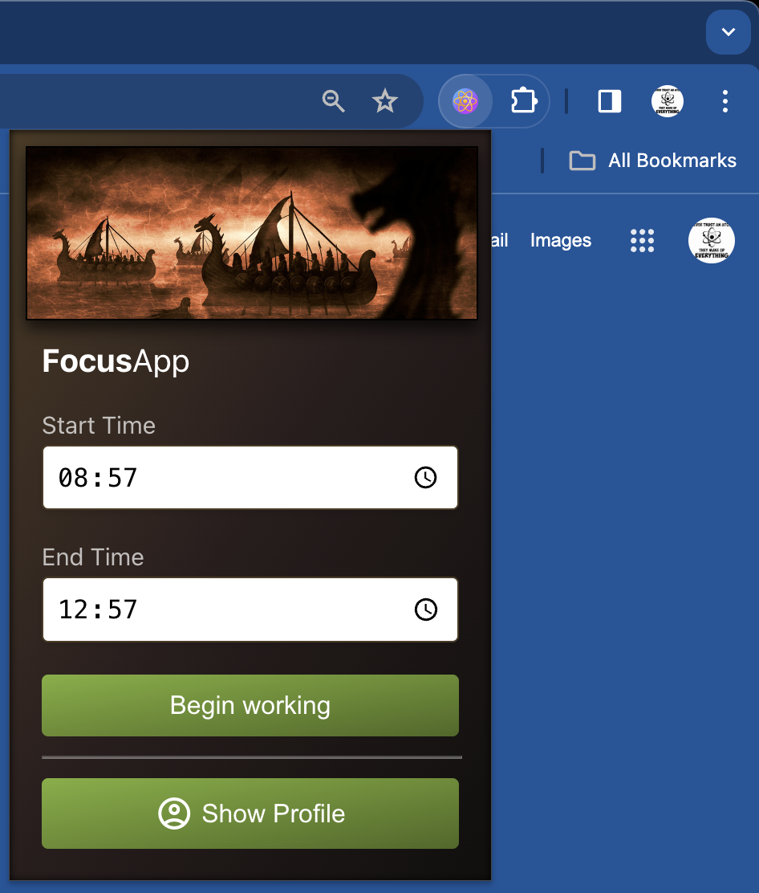
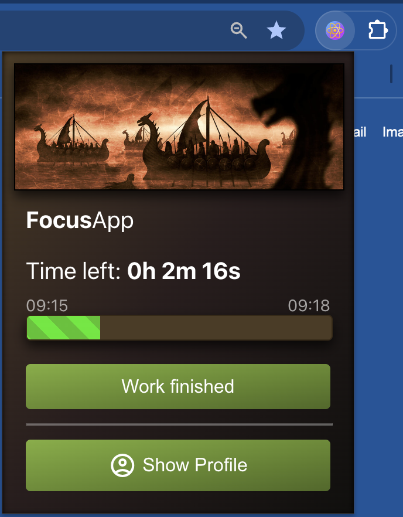
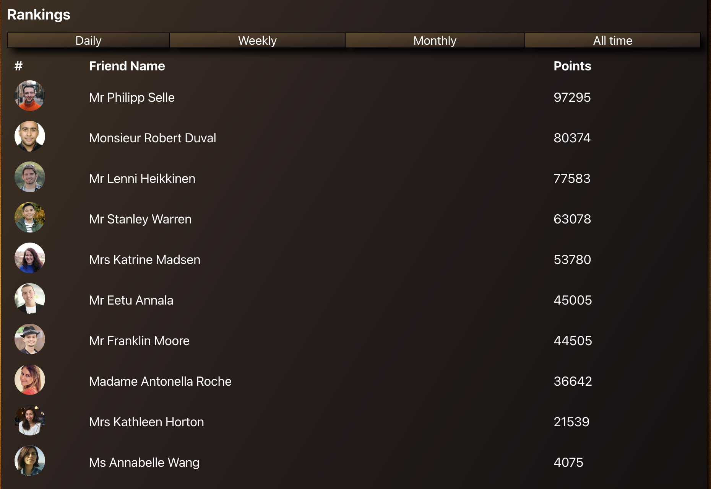
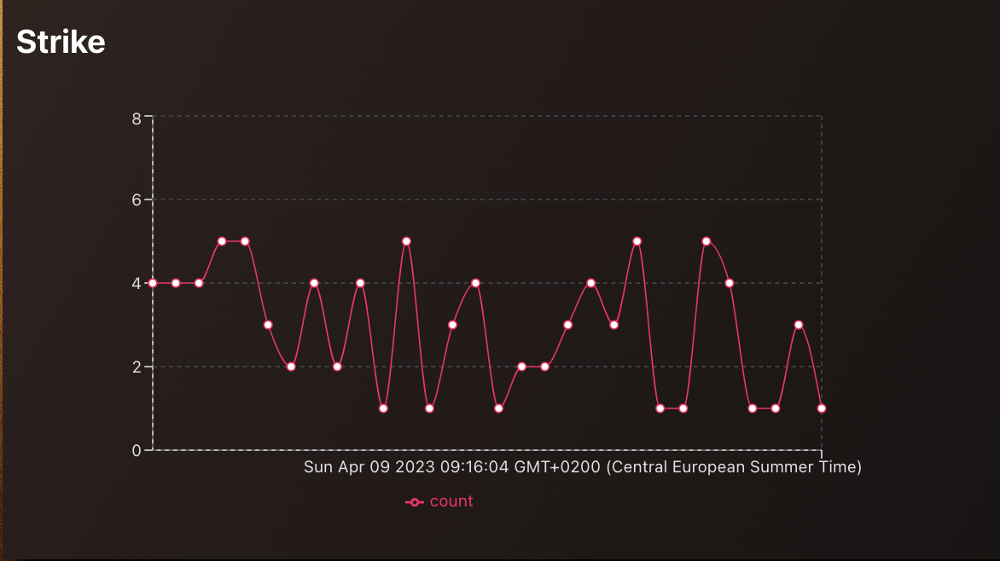

# FocusApp

FocusApp to platforma wspomagająca skupienie i pomagająca wydłużyć attention span.
FocusApp to jednocześnie wtyczka do chrome monitorująca czas stupienia jak i platforma społecznościowa wprowadzająca elementy gamifikacji, nagradzające użytkownków unikających platform społecznościowych w trakcie nauki oraz pracy.
Elementy gamifikacji są wzorowane na najlepszej platformie społecznościowej - GitHubie 😃.

Użytkownik wybiera w wtyczce kiedy chce zacząć pracować / uczyć się:

Wtyczka monitoruje czas pracy użytkownika i przesyła informacje o odwiedzanych stornach do backendu, który analizuje przeglądane strony

Profil użytkownika zawiera:
- "attention graph" pokazujący czas skupienia w każdym dniu w poprzednim roku, wzorowane na GitHub-owych kafelkach (czego się nie robi dla zielonych kwadracików z GH)

- Rankingi punktów atencji użytkowników

- Wykres aktywności z ostatnich 30 dni

